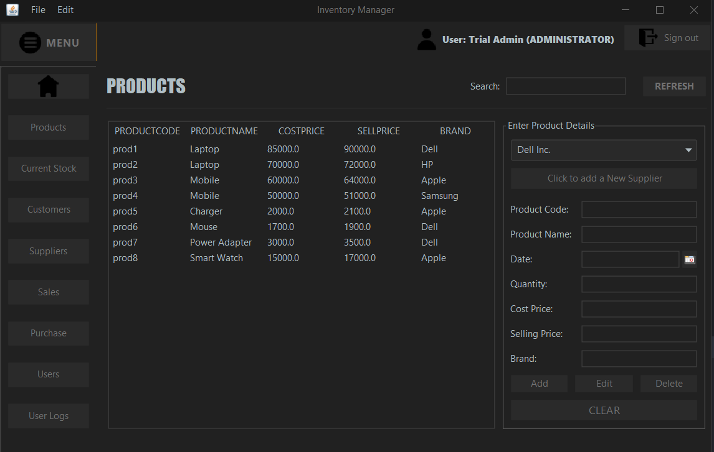

# Inventory Management System

This Inventory Management System is a desktop application with a graphical user interface, developed in Java with MySQL as the database backend. The user interface is designed with Swing, and JDBC API is used for seamless database connectivity.

This system is ideal for small to medium-sized stores, allowing easy management and maintenance of inventory for:

    Products
    Customers
    Suppliers
    Users
    Transactions


## Features of the Application

- Users can oversee inventory and manage the stock of all products available in the store.
- Users can track and handle all sales and purchase transactions conducted by the store.
-  Offers two user roles:
        Administrator
        Employee
    [Administrators have full control to manage all staff.]
 -  Every transaction automatically updates stock levels in the inventory.
 -  Each section features a search function, making it easy for users to locate specific data.
 -  During sales, users simply input the product code, and the system automatically retrieves all relevant details from the database.
 - Logs and maintains a time record of all user activity within the application.

## How to download and run the software

#### Minimum Requirements: JDK or JRE version 16.

1. Download and unzip the ZIP folder: [InventoryManagement.zip](InventoryManagement.zip)
2. Download the [SQL dump file](SQL/InventoryDB.sql)
3. Import the SQL dump file using MySQL Workbench to locally create the sample schema and tables associated with this software.
4. After the inventory schema has been locally created, you can go ahead and run the JAR file (InventoryManagement.jar) included in the zip folder.
5. Default credentials for the connection to MySQL database is:
    - Username: root
    - Password: root
  
    Incase your database uses a different username and password to connect, follow these steps:
    1. Go to the `lib` folder in the zip file that you downloaded.
    2. Open the XML source file `DBCredentials.xml`.
    3. Simply change the values of the two `entry` tags with values `username` and `password` from "root" to whatever username and password you are using. (Ln 12 and 13)
        ```xml
          <properties>
          <comment>Credentials for the database.</comment>
            <entry key="username">root</entry>
            <entry key="password">root</entry>
          </properties>
        ```
6. Once these credentials match, the JAR file should execute without any issues provided that you have the minimum JRE.
7. You can log into the application using Username: `root` and Password: `root`.

### Note:

All the project dependencies are available in the [`lib`](lib/) directory.

***


## Application Preview

### Login Page

The login page takes in the credentials entered by the user and verifies with the database.


### Dashboard/Welcome Page

The landing page of the application after a successful login.


### Products

The products section allows the user to add, edit and delete products from the store's inventory.



### Current Stock

This section allows the user to check the availability of every item.


### Suppliers

Here, the user can manage and manipulate the record of all the suppliers associated with the store.


### Customers

Allows user to add new customers or update/delete existing customers in the database.


### Sales

This section is where users can sell a product and manage all the sales transactions. 
The user only needs to enter the customer and product code and the software will handle the rest, showing all the necessary details like available stock and selling price of the product. 


### Purchase

This section is where users can view purchase logs and enter new purchase transactions. Similar to the sales section, this section only requires the user to enter the product code and the details that are already available in the database will immediately be displayed in the respective spaces.


### Users

This section is only available to **ADMINISTRATORS**. It allows them to view, add and delete any users.


### User Logs

Stores and shows the administrator a log of all the users that have previously logged in, including their login time and logout time.


***

## Technologies Used

The following are the technologies that have been used in the development of this project. All of them are free to use.
  - JetBrains IntelliJ IDE
  - Apache NetBeans IDE (for the GUI designer)
  - MySQL Server and Workbench
  - JDK 16

## ER Diagram

The ER diagram for the sample schema that has been used in the application.


## Source Code

The software code has been divided into four different packages:
  - Data Access Object (DAO): Contains the data access layer of the software that interacts directly with the database and its tables. Used for retrieval and modification of data.
  - Data Transfer Object (DTO): Contains the data transfer layer that allows the data to be transferred between the data access layer and the UI layer.
  - Database: Contains the ConnectionFactory class that retrieves the database connection and verifies user credentials for the application.
  - User Interface (UI): Contains all the GUI classes making up the interface layer of the software.

Click [here](src/com/inventory/) to skip directly to the source code.

